# IoT반 MFC 추가 학습

IoT반 MS MFC 학습 리포지토리

## MFC?


Microsoft Foundation Class 의 약자. C++ 기반의 윈도우 프로그래밍 라이브러리 중 하나.

**GUI**를 디자인, 실행하는 앱을 만들기 위해서 MS에서 만든 기술

- Linux : Qt, GTK, wxWidgets ....
- Windows : Qt, Win32API, ...

리눅스와 윈도우가 OS 기반이 다르기때문에 초기에 표준화를 못함.

Win32 API 기반으로 GUI를 라이브러리화 -> Win32 API를 C++ 클래스로 감싸놓은 라이브러리

윈도우에서만 동작하는 GUI 라이브러리 프레임워크임.

현재는 리눅스에서 Wine 에뮬레이터로 Windows 기반 GUI도 실행 가능(PC카톡 윈도우 버전)

### MFC 단점 및 장점

#### 단점

- 너무 어렵다. 최소 6개월은 공부를 해야하는 문제
- 오래된 기술로 생각보다 최신 튜토리얼이 별로 없음
- 기업이 예전부터 사용하던 솔루션 기반이 변경하기 힘들어서 계속 사용

#### 장점

- C++ 자체가 어려운데 MFC를 사용하면 복잡한 Win32 API를 직접 다루지 않아도 구현이 가능
- 생산성 향상 : 기존 C/C++ 대비하여 생산성 높다는 의미. C#, Java등 OOP와는 비교하면 안됨
- C++ 실력이 많이 좋아짐

### MFC 학습 링크

- [Microsoft Learn](https://learn.microsoft.com/ko-kr/cpp/mfc/class-library-overview?view=msvc-170)

## MFC 튜토리얼

### 순수 Win32 API로 윈도우 만들기

- 중요! Windows 32 bit에서 C++에 있는 여러 기능을 손쉽게 쓰도록 만들어놓은 API(Application Programming Interface)
- 최초에는 이를 통해서 윈도우를 직접 개발

#### Visual Studio 실행


- Windows 데스크톱 마법사 로 시작


- 프로젝트 이름 `Win32FirstApp` 으로 지정


- 애플리케이션 종류
  - 콘솔 : 터미널에서 실행하는 CLI 앱
  - 데스크톱 : GUI로 실행하는 앱
  - 동적 연결 라이브러리(dll) : 다른 앱과 연결되는 라이브러리 또는 함수만 가지고 있는 패키지. 실행 후에 필요할 때 호출
  - 정적 라이브러리(lib) : dll과 거의 유사. 컴파일시에 포함되는 라이브러리


- 데스크톱 애플리케이션 선택, 빈 프로젝트 체크 후 확인


- 빈 프로젝트 생성


- main.cpp 추가

#### 기본 Win32 코드 작성


- `#include <windows.h>` 작성 후 저장 하면 위 외부 종속성 헤더파일들 추가됨. windows와 관련된 함수들을 마음대로 쓸 수 있다라는 의미

```cpp
// 윈도우 메시지를 처리하는 함수!!!!
LRESULT CALLBACK WndProc(     // LRESULT int64 타입의 포인터로 리턴
	HWND hwnd,
	UINT message,
	WPARAM wParam,
	LPARAM lParam
);

// 개념적
WndProc(
    현재창의 HWND,
    WM_DESTROY, // 윈도우창을 닫으라는 메시지
    추가정보,
    다른 추가정보
);
```

- LRESULT : int64 타입 LONG_PTR 포인터 크기를 의미. 32비트 OS든 64비트 OS든 기존 소스 그대로 사용하고자 만든 타입
  - Windows 메시지를 처리한 다음 Windows에게 돌려주는 결과값

- CALLBACK : 타입이 아니고 함수를 어떤 방식으로 호출할지 지정하는 매크로
- `HWND` : 윈도우 핸들. 식별번호와 참조값. 윈도우 내부 객체(포인터)를 직접 접근하면 위험함. 그래서 조금만 잘못하면 프로그램이 깨질 수 있기 때문에 핸들값으로 전달
- UINT : Unsigned Integer
- WPARAM : Word Parameter(윈도우 크기만큼의 Unsigned Integer), 메시지에 첫번째 추가 메시지 데이터.
  - 마우스 클릭시 위치값(x, y 좌표 등)

- LPARAM : Long Parameter(uint), 두번째 추가 메시지 데이터
- [소스코드 설명](./basic/MfcBasicSolution/Win32FirstApp/main.cpp)


- 전체 작성 후 실행화면(MFC 근간)

#### 버튼 컨트롤 추가

- 소스코드


- 버튼 및 클릭 메시지 추가 화면


- 윈도우 스타일, 버튼 스타일 등 변경 화면


- 텍스트 컨트롤 추가 화면

### MFC 프로젝트 생성

- Visual Studio 2026
  - 도구 > 도구 및 기능 가져오기...
- Visual Studio Installer 화면에서


- 개별 구성 요소 추가


- MFC 앱 선택


- MFC 옵션 창 - 필요한 내용을 선택해야 함
  - 애플케이션 종류 - `단일 문서(SDI)`, `여러 문서(MDI)`, 대화상자 기반(Dialog) ...


- 문서 템플릿 속성 - 기본 사용 권장


- 사용자 인터페이스 기능 - 디자인 변경. 필요시 변경


- 고급 기능 - 대체적으로 기본 사용


- 생성된 클래스 - 이름 확인


- MDI로 실행화면

### MFC 기초 학습

#### 기초 사상

순수 Win32 컨트롤 생성 함수

```cpp
HWND wnd = CreateWindow(...);
```

MFC 는 각 컨트롤을 C\_ 로 미리 만들어 놓음

```cpp
CWnd
CDialog
CButton
CEdit
CStatic
```

#### 대화상자 기반 앱


- 애플리케이션 종류 대화 상자 기반(Dialog based) 선택


- 대화상자 기반으로 하면 대부분 옵션이 비활성화 됨


- 시스템 메뉴, 정보 상자 도 체크 해제


- 고급 기능도 전부 해제


- 생성된 클래스 확인 후 마침


- 스캐폴딩 진행 후

##### 프로젝트 구성


- 프로그램 자체
  - MFCBasic.h
  - **MFCBasic.cpp** : 프로그램 시작점(EntryPoint)
- 화면(Dialog) UI
  - **MFCBasicDlg.h** : Dlalog 클래스 선언 헤더 파일
  - **MFCBasciDlg.cpp** : 화면 수정시 가장 많이 변경하는 파일
- 리소스 UI
  - **MFCBasic.rc** : 가장 중요한 리소스파일. 다이얼로그 UI, 메뉴, 아이콘, 툴바, 문자열 테이블, 버전, 비트맵...
  - MFCBasic.rc2 : 사용 안함, 백업과 유사
  - `Resource.h` : rc에 있는 리소스 ID를 정의
  - MFCBasic.ico : 기본 아이콘 MFC로고
- MFC 공통설정
  - pch.h
  - pch.cpp : Precompiled Header용 cpp. 수정 안함. VS가 사용하는 파일
  - framwork.h : 프로젝트 전체 사용하는 Windows 헤더 포함
  - targetver.h : 지원할 Windows 버전 지정

##### 디자인 화면

리소스 뷰(Ctrl + Shift + E) 전환 뒤, Dialog의 IDD_MFC... 클릭하면


- 디자인 확인 가능
- Dialog Based는 리소스에서 확인 가능하지만, SDI/MDI는 전체 화면을 확인할 메뉴/디자인뷰가 없음

| 방식         | 의미                  | 난이도 |
| ------------ | --------------------- | -----: |
| Dialog Based | 일반 폼 형태          |      ★ |
| SDI          | 한 문서 중심 프로그램 |    ★★★ |
| MDI          | 여러 문서/창 관리     |  ★★★★★ |

##### CWinApp 클래스

- MFCBasic.h 소스

```cpp

class CMFCBasicApp : public CWinApp
```

- CWinApp은 MFC가 제공하는 클래스이고 우리가 만든 CMFCBasicApp은 이를 상속한 자식 클래스

##### WinMain()이 없다! 대신 InitInstance() 가 중요!!

- MFC의 첫번째 핵심 요소! MFC에는 WinMain() 함수가 없음
- MFC가 대신 처리한다

```plaintext
# Win32 API

WinMin() 실행
     ↓
윈도우 실행
     ↓
메시지 루프
     ↓
WndProc()
```

```plaintext
# MFC

MFC 내부 WinMain() 자동 실행
     ↓
CWinApp
     ↓
InitInstance()
     ↓
Dialog 생성
```

- MFCBasic.cpp 소스

```cpp
// MFC 프로그램 시작시 실행되는 초기화 함수
BOOL CMFCBasicApp::InitInstance()
{
    CWinApp::InitInstance();   // 부모 객체도 초기화 한다
    ...
```

- WinMain() 에서 작성한 초기화 코드를 대부분 여기에 처리함

##### CDialogEx 클래스

- MFCBasicDlg.h 소스

```cpp
class CMFCBasicDlg : public CDialogEx
{
// 생성입니다.
public:
	CMFCBasicDlg(CWnd* pParent = nullptr);	// 표준 생성자입니다.

```

- CWnd > CDialog > CDialogEx > CMFCBasicDlg

##### Win32 API와 가장 큰 차이

- Win32 API는 `HWND hwnd;` 라는 핸들을 중심으로 코딩
- MFC는 `CMFCBasicDlg dlg;` C++ 객체로 코딩. 실제 MFC 내부에 HWND 로 구성되어 있고, 이걸 MFC가 핸들링
- MFC CWnd는 Win32 API의 HWND를 C++ 클래스로 감싸 놓은 것일 뿐

#### MFC로 컨트롤 구성하기

##### 다이얼로그 리소스


- 도구상자 오픈


- 버튼 추가
- 속성에서
  - ID : IDC_BUTTON_OK
  - 캡션 : 확인
- 확인 버튼을 더블클릭

```cpp
void CMFCBasicDlg::OnBnClickedButtonOk()
{
    // TODO: 여기에 컨트롤 알림 처리기 코드를 추가합니다.
    AfxMessageBox(L"헬로우 MFC!");
}

```

- TODO 영역을 작성하면 됨 -> C# WinForms, WPF와 동일


- 실행결과

##### WM_COMMAND 가 없다

- MFC의 Message Map에서 처리해 줌
- MFCBasicDlg.cpp 소스
  - 버튼 추가하고 더블클릭해서 이벤트 함수가 생성되면 ON_BN_CLICKED... 자동 추가됨

```cpp
BEGIN_MESSAGE_MAP(CMFCBasicDlg, CDialogEx)
	ON_WM_PAINT()
	ON_WM_QUERYDRAGICON()
	ON_BN_CLICKED(IDC_BUTTON_OK, &CMFCBasicDlg::OnBnClickedButtonOk)
END_MESSAGE_MAP()
```

##### 장점

```cpp
	case WM_COMMAND:
		if (LOWORD(wParam) == 1001) {
			MessageBox(
				hwnd,
				L"버튼을 클릭했습니다.",
				L"알림",
				MB_OKCANCEL
			);
		}
		return 0;
```

- 위와 쓴 코드를

```cpp
void CMFCBasicDlg::OnBnClickedButtonOk()
{
    AfxMessageBox(L"헬로우, MFC!!");
}
```

- C++ MFC로 위와 만큼 줄였다는 것이 장점
  - Win32 API -> WndProc + WM_MESSAGES + HWND
  - MFC -> CDialogEx + Message Map + CButton

#### Resource Editor

Visual Studio 가 제공하는 **GUI 디자이**너 기능. C# WinForms의 Form Designer와 같은 역할

기능은 동일하지만 C# WinForms보다 제약사항이 많고, 대부분 코딩으로 처리를 해야 함

리소스 뷰(Ctrl + Shift + E)


- MDI의 경우에 생성되는 리소스 구조


- STATIC, EDIT, BUTTON 세개로 구성
- MFC에서 추천하는 이름은 일반적으로 IDC\_ Prefix 사용

##### ID가 가장 중요

ID로 코드에서 제어

##### 탭 오더

윈폼 탭으로 컨트롤 이동시 순서 지정

디자인 레이아웃 창에서 Ctrl + D


- 번호를 클릭해서 변경

##### 로그인 화면 만들기


- STATIC 2개, EDIT 2개, BUTTON 2개 구성
- 디자인 후 Resource.h 확인

```cpp
//{{NO_DEPENDENCIES}}
// Microsoft Visual C++에서 생성한 포함 파일입니다.
// MFCControls.rc에서 사용되고 있습니다.
//
#define IDC_BTN_LOGIN                   2
#define IDD_MFCCONTROLS_DIALOG          102
#define IDR_MAINFRAME                   128
#define IDC_EDIT_ID                     1000
#define IDC_STATIC_ID                   1002
#define IDC_STATIC_PW                   1003
#define IDC_EDIT_PW                     1004
#define IDC_BTN_CANCEL                  1005
```

##### 이벤트 처리

```cpp
	// 컨트롤에 있는 캡션을 변수 할당
	CString strID;
	GetDlgItemText(IDC_EDIT_ID, strID);

	CString strPW;
	GetDlgItemText(IDC_EDIT_PW, strPW);

	// 입력검증(Validation Check)
	if (strID.IsEmpty()) {
		AfxMessageBox(L"아이디를 입력하세요.");
		return;
	}

	if (strPW.IsEmpty()) {
		AfxMessageBox(L"패스워드를 입력하세요.");
		return;
	}

	//AfxMessageBox(strID);

	if (strID == L"admin" && strPW == L"p@ssw0rd!") {
		AfxMessageBox(L"관리자 로그인!");
	}
	else {
		AfxMessageBox(L"로그인 실패!!!");
	}

	//CString msg;
	//msg = strID + L"님 환영합니다!!";

	//AfxMessageBox(msg);
```


- 관리자 로그인 처리
- 입력검증 ID, PW


- 실행결과

#### DDX / DDV

```csharp
TxtName.Text // C# 방식
```

- C# 방식. 아주 간단

```cpp
UpdateData(TRUE);
```

- MFC 방식

##### 현재 예제 문제점

만약 컨트롤이 20개 있으면

```cpp
GetDlgItemText(IDC_..., var1);
GetDlgItemText(IDC_..., var2);
GetDlgItemText(IDC_..., var3);
GetDlgItemText(IDC_..., var4);
GetDlgItemText(IDC_..., var5);
GetDlgItemText(IDC_..., var6);
....
GetDlgItemText(IDC_..., var20);
```

이런 불편한 점을 개선한것이 DDX

- Dialog와 변수 사이의 데이터를 자동으로 교환하는 기능

##### 로그인 예제를 DDX로 변경


- 다이얼로그 Context Menu > 변수 추가 선택


- ID Edit 컨트롤 선택 상태에서 > Context Menu > 변수 추가


- 아이디 컨트롤 내 값 담을 수 있는 변수 추가

```cpp
public:
	afx_msg void OnBnClickedBtnLogin();
	afx_msg void OnBnClickedBtnCancel();
	// 아이디 값 변수
	CString m_editID;
	// 패스워드 변수 값
	CString m_editPW;
};
```

- MFCControlsDlg.h에 위와 같이 추가 확인

```cpp
void CMFCControlsDlg::DoDataExchange(CDataExchange* pDX)
{
	CDialogEx::DoDataExchange(pDX);
	DDX_Text(pDX, IDC_EDIT_ID, m_editID);
	DDX_Text(pDX, IDC_EDIT_PW, m_editPW);
}

```

- MFCControlsDlg.cpp 에 DoDataExchange() 함수에 추가된 내용 확인
- OnBnClickedBtnLogin() 함수내 작성 내용 삭제

```cpp
UpdateData(TRUE);

AfxMessageBox(m_editID);
```

- GetDlgItemText() 가 컨트롤별로 수행할 필요가 없음
- UpdateData(TRUE) : 데이터 읽기
- UpdateData(FALSE) : 데이터 쓰기

여기까지가 DDX Value로 처리하는 방식임

##### DDX Control

변수값이 아닌 컨트롤 자체를 제어하고자 할때 사용

- 로그인을 성공하고 난뒤 아이디 입력창 비활성화
- 포커스 이동

과 같은 작업에 DDX Control 사용

- 다이얼로그 창 > Context Menu > 변수 선택
- 범주 컨트롤 선택, m_controlID, m_controlPW 추가
- 로그인 버튼, m_btnLogin 로 변수 추가

```cpp
	DDX_Control(pDX, IDC_EDIT_ID, m_controlID);
	DDX_Control(pDX, IDC_EDIT_PW, m_controlPW);
	DDX_Control(pDX, IDC_BTN_LOGIN, m_btnLogin);
```

- DoDataExchange() 함수에 추가된 로직 확인


- SetWindowText() : 실행 후 로그인 버튼 클릭하면, IDC_EDIT_ID 컨트롤에 admin 텍스트 할당


- GetWindowText() : 컨트롤의 텍스트를 변수에 할당, GetDlgItemText()와 동일

##### DDV

Dialog Data Validation. 컨트롤에 제대로 된 입력값이 들어갔는지 검증

```cpp
void CMFCControlsDlg::DoDataExchange(CDataExchange* pDX)
{
    CDialogEx::DoDataExchange(pDX);
...
    // ID를 20자로 제한!
    DDV_MaxChars(pDX, m_editID, 20);
}
```


- 아이디를 20자 이상 입력했을때 실행화면
- DDV 함수 종류 : DDV_MinMaxInt(), DDV_MinMaxUInt(), DDV_MinMaxDouble(),

#### 회원로그인 화면 만들기

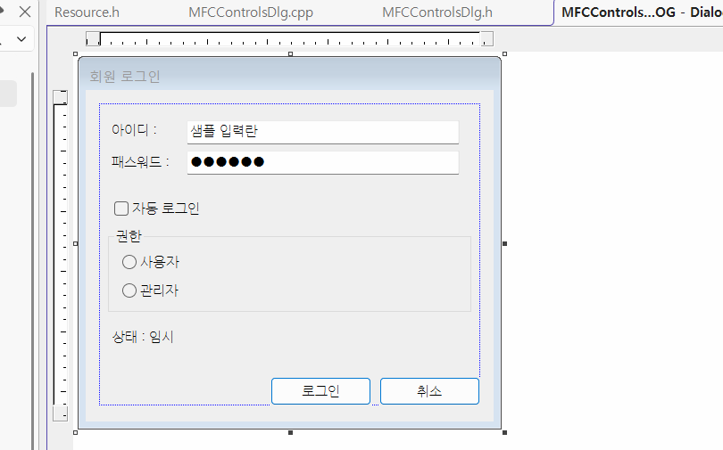

- Static 3 개 : IDC_STATIC_ID, IDC_STATIC_PW(사용X), IDC_STATIC_STATUS(소스코드 사용)
- Edit 2 개 : IDC_EDIT_ID, IDC_EDIT_PW
- CheckBox 1개 : IDC_CHK_AUTOLOGIN
- Radio Button 2개 : IDC_RDO_USER(첫번째 라디오버튼 그룹 속성을 True), IDC_RDO_ADMIN(그룹 속성 False)
- Button 2개 : IDC_BTN_LOGIN, IDC_BTN_CANCEL

##### DDX(Value) 설정

- 아이디, 패스워트 텍스트박스, 자동 로그인, 라디오 버튼 값 DDX 생성
  - IDC_EDIT_ID : CString m_strID
  - IDC_EDIT_PW : CString m_strPW
  - IDC_CHK_AUTOLOGIN : BOOL m_bAutoLogin
  - IDC_RDO_USER : int m_nUserType

##### DDX(Control) 설정

- 로그인 버튼, 아이디 에디트, 상태 스태틱 컨트롤 DDX 추가
  - IDC_EDIT_ID : CEdit m_editID
  - IDC_STATIC_STATUS : CStatic m_staticStatus
  - IDC_BTN_LOGIN : CButton m_btnLogin

##### DDX 사용시 발생 오류

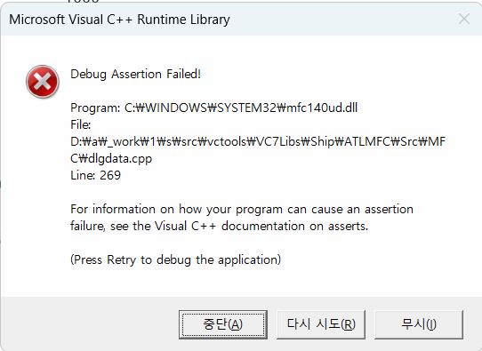

- DDX 설정 시 컨트롤 속성이 알맞지 않으면 발생하는 오류
- 예) 라디오버튼 여러개일때 첫번째 컨트롤은 그룹 속성 True, 나머지는 False

##### 대화상자 기반 MFC 닫기버튼 추가

- 리소스뷰에서 Dialog 선택
- 다이얼로그 전체 선택 후 속성
- 테두리(Border) > Resizing으로 선택
- 시스템메뉴(System Menu) > True로 변경
- 최소화 상자, 최대화 상자 활성화 됨

또는 코드로 작성가능

```cpp
BOOL CMFCControlsDlg::OnInitDialog()
{
	CDialogEx::OnInitDialog();

	// 코드로 닫기버튼 추가!
	ModifyStyle(
		0,
		WS_MINIMIZEBOX |
		WS_MAXIMIZEBOX |
		WS_THICKFRAME |
		WS_SYSMENU
	);
 ...
```

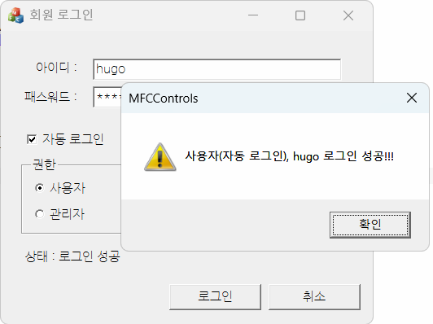

- 실행결과

#### Timer

1초마다 시간이 변경되는 프로그램을 만들때 사용하는 컨트롤

##### 대화상자 기반 프로젝트

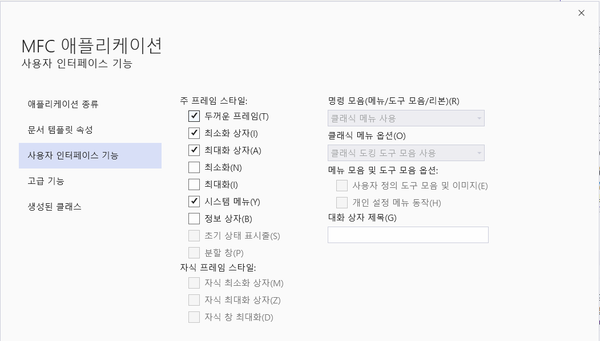

- 사용자 인터페이스에서 두꺼운 프레임, 최소화 상자, 최대화 상자, 시스템 메뉴 선택
  - 윈폼 UI와 유사하게 디자인

##### 타이머 예제

- STATIC 2개 중 1개 실제 시간표시 컨트롤 : IDC_STATIC_TIME -> DDX 컨트롤 m_staticTime 변수 추가
- BUTTON 2개 시작, 정지 버튼 : IDC_BTN_START, IDC_BTN_STOP

##### Timer ID 정의

타이머를 여러개 지정가능하므로 ID 지정

`#define TIMER_CLOCK 1`

##### 시작 버튼 함수

메뉴 프로젝트 > 클래스 마법사 선택

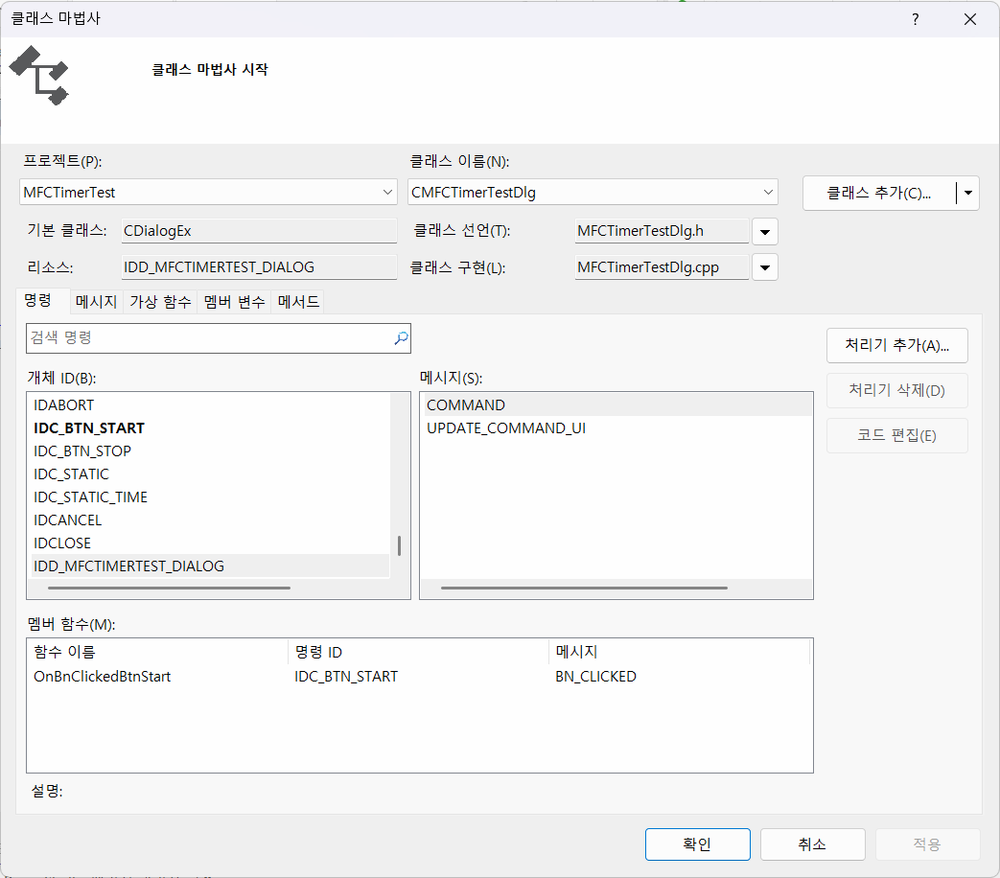

- 실제 MFC에서 클래스 추가 작업할 때 많이 사용하는 창

##### WM_TIMER 메시지 추가

- 클래스 마법사 창 메시지 탭에서 WM_TIMER 메시지 리스트에서 확인 후, 더블클릭
- OnTimer 함수가 자동 추가됨

##### 시작, 정지 버튼 함수 추가

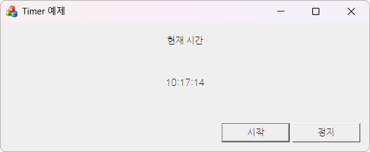

##### IDC_STATIC_TIME 글자크기 변경

- Dlg 헤더에 `CFont m_fontTime` 추가
- OnInitDialog() 에서 초기화 로직 추가

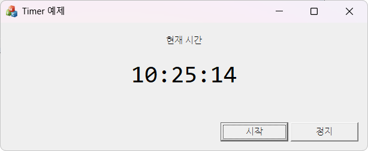

- 폰트 변경화면

#### 메뉴, 기본 Dialog

##### 메뉴

Dialog Based MFC에서는 적합하지 않음. SDI/MDI로 프로젝트 생성해야

##### SDI 프로젝트 생성

- 애플리케이션 종류 탭
  - 단일 문서(SDI)
  - 나머지는 기본으로

- 문서 템플릿 속성
  - 파일 확장명은 txt 처럼 확장자만
  - 필터 이름 변경

- 사용자 인터페이스 기능 - 그대로
- 고급 기능
  - 자동화, ActiveX 컨트롤, Windows 소켓 거의 필요없음. 체크 해제

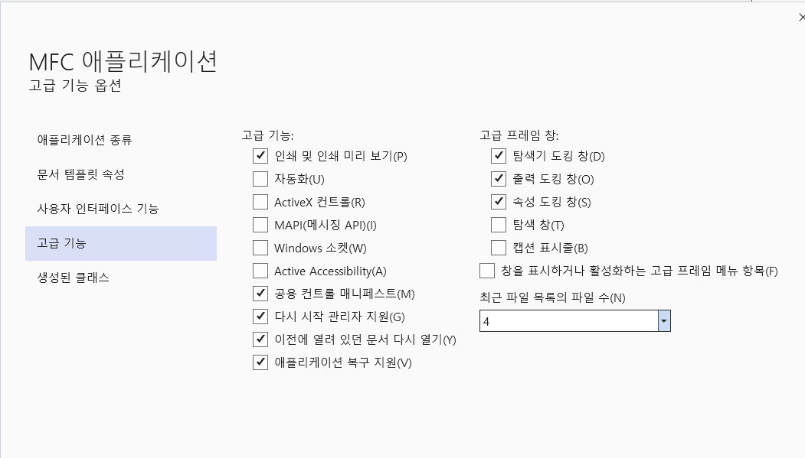

- 생성된 클래스 - 그대로

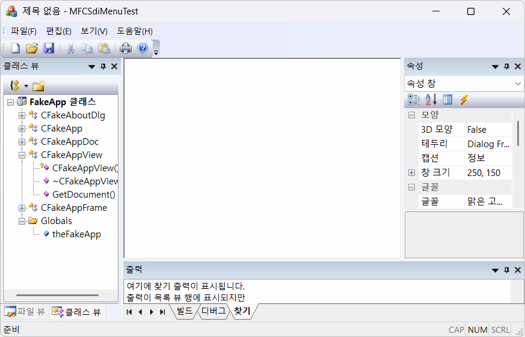

- 실행결과

##### SDI 구조 이해

MainFrame : 메뉴, 툴바, 뷰, 상태바 등 전체 관리

##### SDI 프로젝트 구조

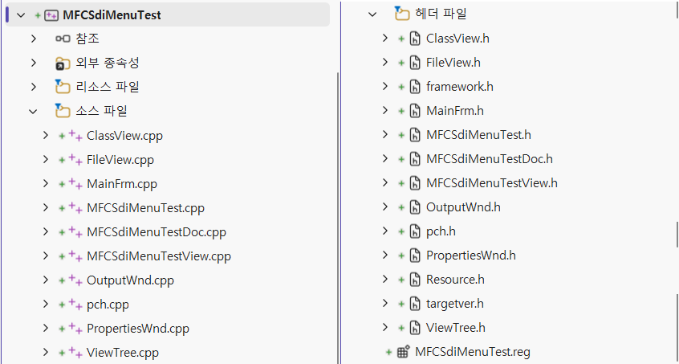

- 소스 파일
  - ClassView.cpp : 왼쪽 클래스 뷰 창 만드는 코드
  - FileView.cpp : 왼쪽 파일 뷰 창 만드는 코드
  - MainFrm.cpp : SDI 가장 핵심 소스코드 ★★★★★
  - MFCSdiMenuTest.cpp : 프로그램 시작 파일 ★★★★★
  - MFCSdiMenuTestDoc.cpp : Document 클래스. 프로그램의 데이터 저장 ★★★
  - MFCSdiMenuTestView.cpp : 개발중에 가장 많이 수정하는 파일. 화면에 그림을 그리는 역할 ★★★★★
  - OutputWnd.cpp : 뷰 중앙아래 빌드, 디버그, 찾기 창 생성, 관리 코드
  - pch.cpp : Precompiled Header 만드는 파일(기본)
  - PropertiesWnd.cpp : 오른쪽 속성 창 만드는 코드
  - ViewTree.cpp : 클래스, 파일 뷰의 트리 담당 코드
  - 문서/뷰 아키텍처 선택시 - ClassView, FileView, MFCS..Doc, MFCS..View, OutputWnd, PropertiesWnd, ViewTree 7개 파일 추가
- 헤더 파일
  - ClassView.h : ClassView.cpp 연결
  - FileView.h : FileView.cpp 연결
  - framework.h : 프로젝트 공통 헤더
  - MainFrm.h : MainFrm.cpp 연결
  - MFCSdiMenuTest.h
  - MFCSdiMenuTestDoc.h
  - MFCSdiMenuTestView.h
  - OutputWnd.h
  - pch.h
  - PropertiesWnd.h
  - Resource.h : 프로젝트 리소스 아이디 ★★★
  - targetver.h : 윈도우 타겟버전 설정
  - ViewTree.h

##### 창, 컨트롤 초기화 확인

- MainFrm.cpp 내 OnCreate() 함수
  - m_wndToolBar 관련 소스 주석 처리

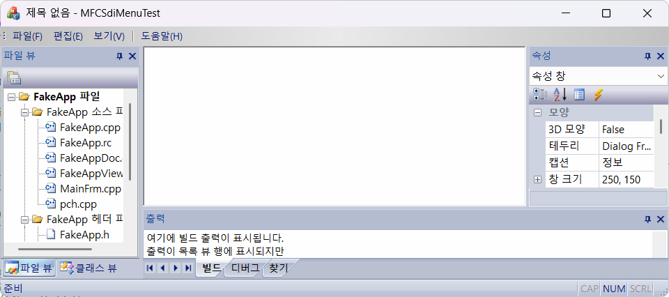

- 툴바 제거

##### 파일뷰/클래스뷰 제거

- MainFrm.h
  - CFileView m_wndFileView 주석처리
  - CClassView m_wndClassView 주석처리
  - 도킹관련 void SetDockingWindowIcons(BOOL bHiColorIcons) 함수 주석처리
- MainFrm.cpp
  - OnCreate() 함수에 헤더파일에서 주석처리한 변수관련 오류코드 주석처리
  - CreateDockingWindows() 오류코드 주석처리
  - SetDockingWindowIcons() 함수를 주석처리

##### 출력창, 속성창 제거

- 위와 동일

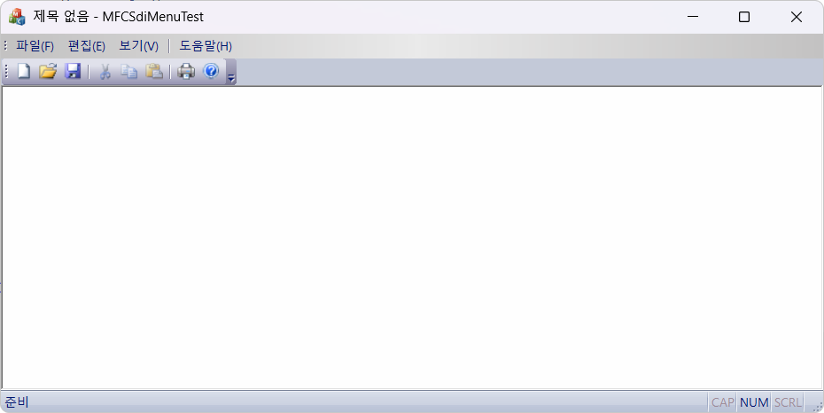

- 실행결과

##### SDI 심플프로젝트

- 도킹, 복잡한 뷰가 필요없을때 프로젝트를 간단하게 생성

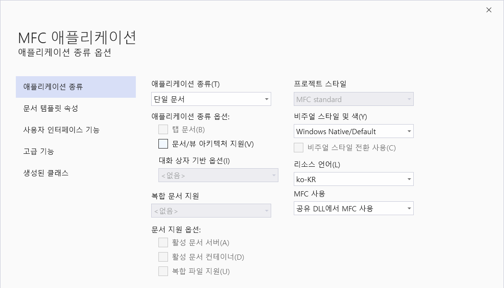

- 단일 문서, 문서/뷰 아키텍처 지원 체크 해제
- 비주얼 스타일 전환 사용 체크 해제

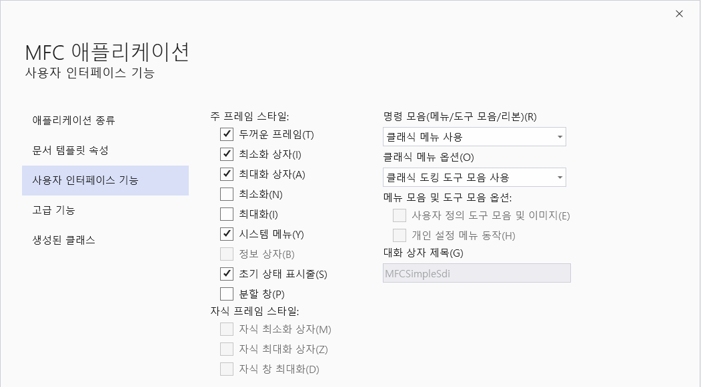

- 명령 모음 > 클래식 메뉴 사용
- 클래식 메뉴 옵션 > 클래식 도킹 도구 모음 사용(툴바 생성)

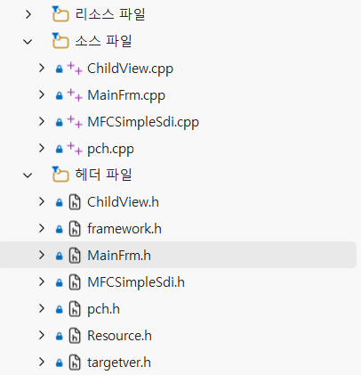

- 기능 축소로 만들었을때 파일 구조
  - ChildView.cpp : 메인프레임 중앙 관리 소스 ★★★★★
  - MainFrm.cpp : 내용 생략 ★★★★★
  - MFCSimpleSdi.cpp : 프로그램 시작점 ★★★★★
  - pch.cpp, framework.h ... : 위와 동일

#### MainFrame

- MainFrm.cpp : 메뉴, 툴바, 상태바, ChildView 외 추가적 클래스뷰, 파일뷰, 출력창, 속성창 을 관리하는 영역
- PreCreateWindow() : 윈도우 창 만들어지기 직전 호출되는 함수. 기존 설정되어 있던 속성을 변경하고할 때
- OnCreate() : 창 생성, 메뉴 생성, 툴바 생성, 상태바 생성(추가적인 창도 생성)

##### Menu 생성

MainFrame에서 IDR_MAINFRAME 리소스 만들면 자동으로 생성

##### 메뉴 리소스

IDR_MAINFRAME 더블클릭 (심플 프로젝트에서는 메뉴가 다름)

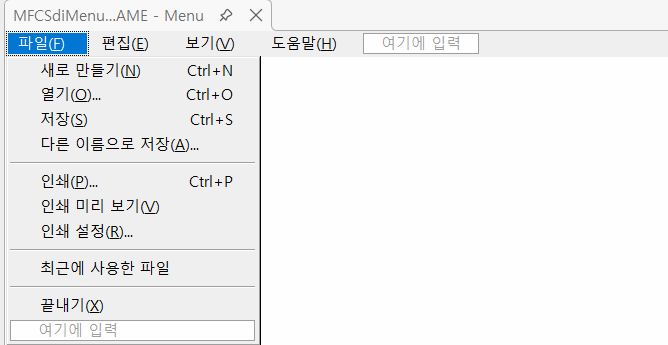

- 메뉴 추가시 키보드 단축키(Alt) 사용 위해서 & 추가 `실습(&P)`

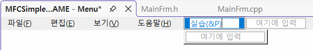

- 하위 메뉴 메시지 출력 추가
- 메시지 출력 체크 속성창 ID_32771 -> ID_PRAC_MSG 로 변경
- 이벤트를 추가하고자 하는 메뉴 > Context Menu > 이벤트 처리기 추가 클릭

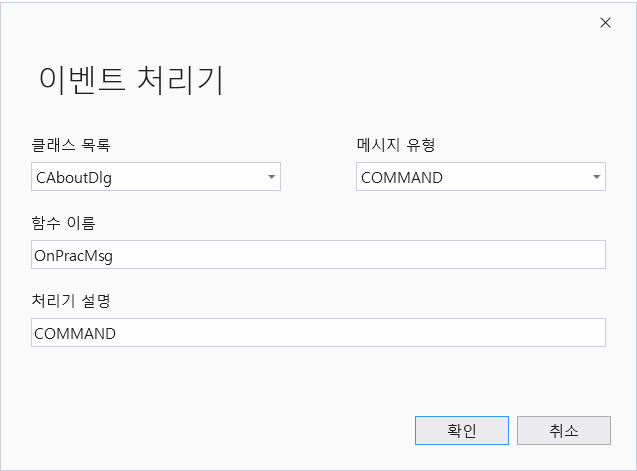

- 클래스 목록에서 ChildView나 CMainFrame 선택

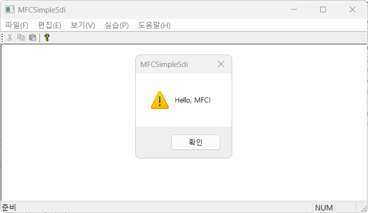

- AfxMessageBox 추가 결과

```cpp
BEGIN_MESSAGE_MAP(CMainFrame, CFrameWnd)
    ON_WM_CREATE()
    ON_WM_SETFOCUS()
    ON_COMMAND(ID_PRAC_MSG, &CMainFrame::OnPracMsg)
END_MESSAGE_MAP()
```

- 버튼 클릭이나 메뉴 클릭 등 메시지가 발생하는 기능 들은 메시지맵에 자동 추가
-
- 체크 메뉴 아이디 ID_MENU_CHECK 로 변경
- 멤버변수 추가 bool m_bChecked = false
- 체크 메뉴 이벤트 처리기 추가

```cpp
void CMainFrame::OnMenuCheck()
{
    CMenu* pMenu = GetMenu();

    m_bChecked = !m_bChecked;

    pMenu->CheckMenuItem(
        ID_MENU_CHECK,
        MF_BYCOMMAND |
        (m_bChecked ? MF_CHECKED : MF_UNCHECKED)
    );

    // TODO : 체크가 되었을때 처리로직과 체크해제시 로직 분리 작성
}
```

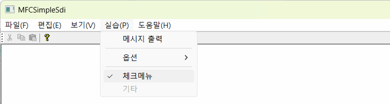

- 메뉴 체크기능 결과 화면
- 메뉴에 - 입력하면 가로줄 추가됨
- 단축키 는 추후 학습 요

##### ChildView

```cpp
void CChildView::OnPaint()
{
    CPaintDC dc(this); // 그리기를 위한 디바이스 컨텍스트입니다.

    // TODO: 여기에 메시지 처리기 코드를 추가합니다.
    // 그리기 메시지에 대해서는 CWnd::OnPaint()를 호출하지 마십시오.
    dc.TextOutW(100, 100, L"MFC ChildView");
}

```

- Win32 API에서 WM_PAINT 와 같은 역할

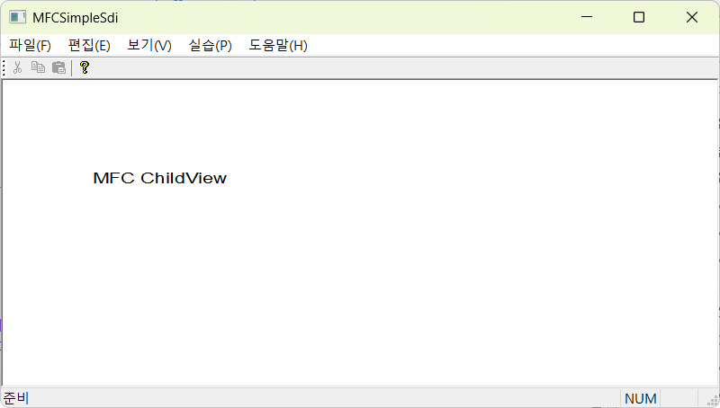

##### GDI

- 윈도우 앱에서 그림을 그리는 인터페이스 기능
- OnPaint() 에 진행

```cpp
	// GDI
	dc.MoveTo(100, 80); // 선이 시작할 위치로 이동
	dc.LineTo(330, 80); // 좌표까지 직선 그리기

	dc.Rectangle(100, 120, 300, 300);
	dc.Ellipse(100, 120, 300, 300);

	CPen pen;   // 펜 생성
	pen.CreatePen(PS_SOLID, 5, RGB(255, 0, 0));

	dc.SelectObject(&pen);  // 펜 선택

	dc.MoveTo(100, 340);
	dc.LineTo(330, 340);
```

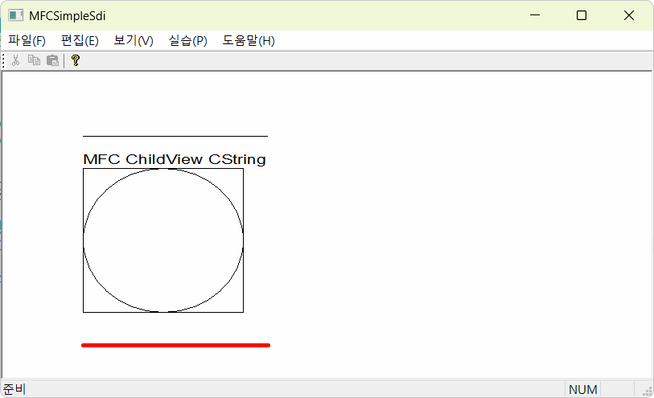

- 실행결과

##### MFC 마우스

- 마우스 메시지
  - WM_LBUTTONDOWN -> OnLButtonDown()
  - WM_LBUTTONUP -> OnLButtonUp()
  - WM_MOUSEMOVE -> OnMouseMove()
  - WM_RBUTTONDOWN -> OnRButtonDown()

```cpp
void CChildView::OnLButtonDown(UINT nFlags, CPoint point) {
	CString str;

	str.Format(L"(%d, %d)", point.x, point.y);

	AfxMessageBox(str);

	CWnd::OnLButtonDown(nFlags, point);
}
```

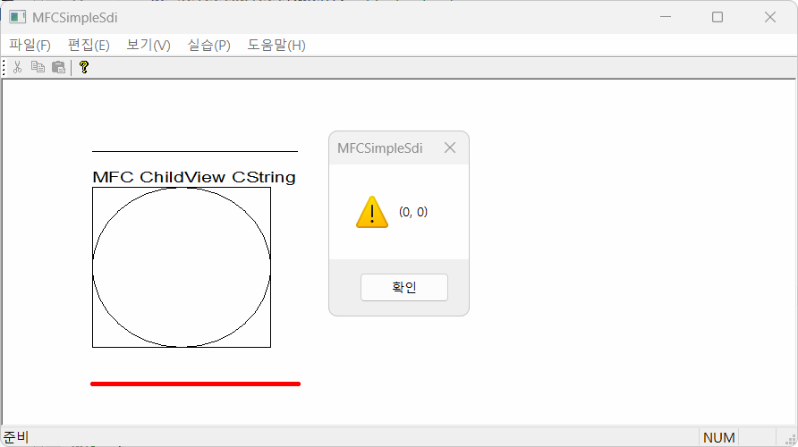

- 마우스 왼쪽 버튼 클릭이벤트 실행결과

```cpp
void CChildView::OnMouseMove(UINT nFlags, CPoint point) {
	CString str;

	str.Format(L"x=%d, y=%d", point.x, point.y);
	GetParent()->SetWindowText(str); // 부모창(MainFrame)의 제목표시줄에 str를 할당

	CWnd::OnMouseMove(nFlags, point);
}
```

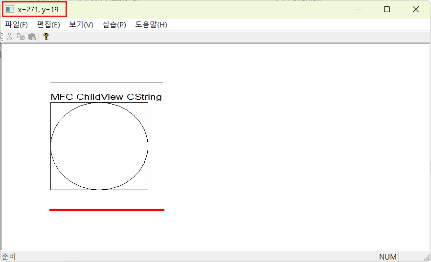

- MouseMove 실행결과

```cpp
private:
	CPoint m_ptClick;  // 클릭한 위치 기억 변수
```

- 마우스 클릭 위치 저장변수 m_ptClick

```cpp
	m_ptClick = point;

	Invalidate();  // 화면 다시그리기 요청 함수

	CWnd::OnLButtonDown(nFlags, point);
```

- OnLButtonDown에 위 코드 추가

```cpp
	dc.Ellipse(
		m_ptClick.x - 30,
		m_ptClick.y - 30,
		m_ptClick.x + 30,
		m_ptClick.y + 30
	);  // 마우스 클릭시마다 원 변경
```

- OnPaint() 아래 원그리기 함수 추가

https://github.com/user-attachments/assets/540ef5ed-f58e-4123-b381-53a579dd118e

```cpp
bool m_bDrag = false;
CPoint m_ptCircle = CPoint(200, 200);
```

- 마우스 드래그 여부 확인변수 m_bDrag
- 원을 그릴 위치 변수 m_ptCircle

```cpp
void CChildView::OnPaint()
{
    ...
	CPen pen2;   // 펜 생성
	pen2.CreatePen(PS_SOLID, 4, RGB(0, 0, 255));
	dc.SelectObject(&pen2);  // 펜 선택

	dc.Ellipse(
		m_ptCircle.x - 30,
		m_ptCircle.y - 30,
		m_ptCircle.x + 30,
		m_ptCircle.y + 30
	);
} // end of OnPaint()

void CChildView::OnLButtonDown(UINT nFlags, CPoint point) {
	...
	m_bDrag = true;
	Invalidate();  // 화면 다시그리기 요청 함수
	CWnd::OnLButtonDown(nFlags, point);
} // end of OnLButtonDown()

void CChildView::OnLButtonUp(UINT nFlags, CPoint point) {
	m_bDrag = false;
} // end of OnLButtonUp()

void CChildView::OnMouseMove(UINT nFlags, CPoint point) {
	...

	if (m_bDrag) {
		m_ptCircle = point;

		Invalidate();  // 화면 업데이트
	}

	CWnd::OnMouseMove(nFlags, point);
} // end of OnMouseMove()

```

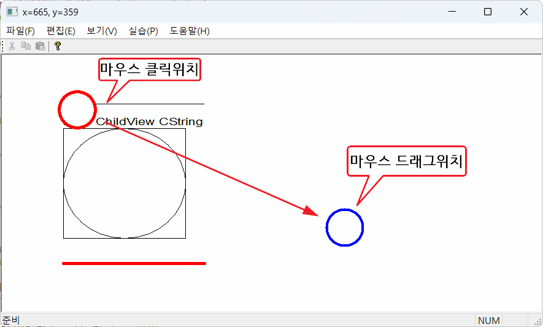

- 마우스 클릭 위치에 빨간원, 드래그시 파란원 따라옴

##### MFC 키보드

- Win32 API 비교
  - WM_KEYDOWN -> OnKeyDown()
  - WM_KEYUP -> OnKeyUp()
  - WM_CHAR -> OnChar() : 특정 키를 눌렀을때
- MessageMap

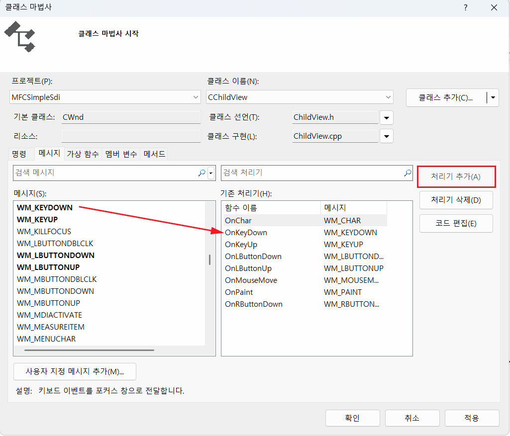

- 메뉴 프로젝트 > 클래스 마법사로 추가 가능
- OnKeyDown() : 모든 키보드의 키값을 가져오기
- OnChar() : 숫자, 알파벳등 실제 키값만 가져옴. 특수키 제외
- OnKeyUp() : 어떤 키던지 누르고 떼면 발생

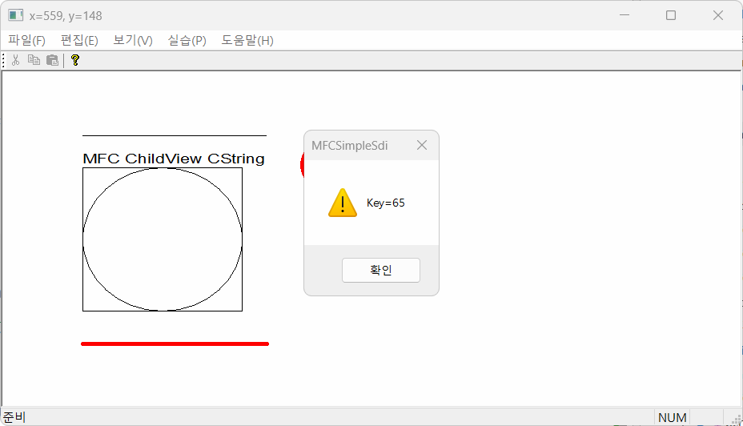

- 대문자 A를 눌렀을때 OnKeyDown() 발생 결과

```cpp
void CChildView::OnKeyDown(UINT nChar, UINT nRepCnt, UINT nFlags)
{
	switch (nChar) {
	case VK_LEFT:
		m_ptBox.x -= 10;
		break;
	case VK_RIGHT:
		m_ptBox.x += 10;
		break;
	case VK_UP:
		m_ptBox.y -= 10;
		break;
	case VK_DOWN:
		m_ptBox.y += 10;
		break;
	}

	Invalidate();  // 화면 다시그리기 요청 함수

	CWnd::OnKeyDown(nChar, nRepCnt, nFlags);
}
```

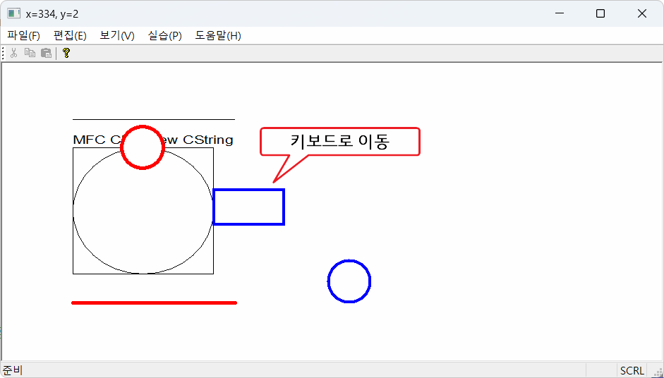

- 키보드로 박스 이동 결과화면
- 만약 키보드가 입력이 안되면. SetFocus() 함수 실행

##### 툴바

- 메뉴바 아래에 아이콘으로 존재하는 버튼 모음
- 메뉴 중에서 자주 사용하는 기능을 버튼으로 빼놓은 것
- 툴바는 MainFrame에서 관리 - Resource View에서 확인

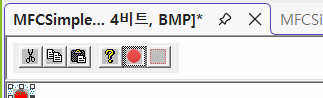

- VS 비트맵 에디터에서 수정 가능 -> Paint.NET 등의 그래픽편집기로 수정
- MFC 클래식 툴바 이미지 4bit bmp로 반드시 지정

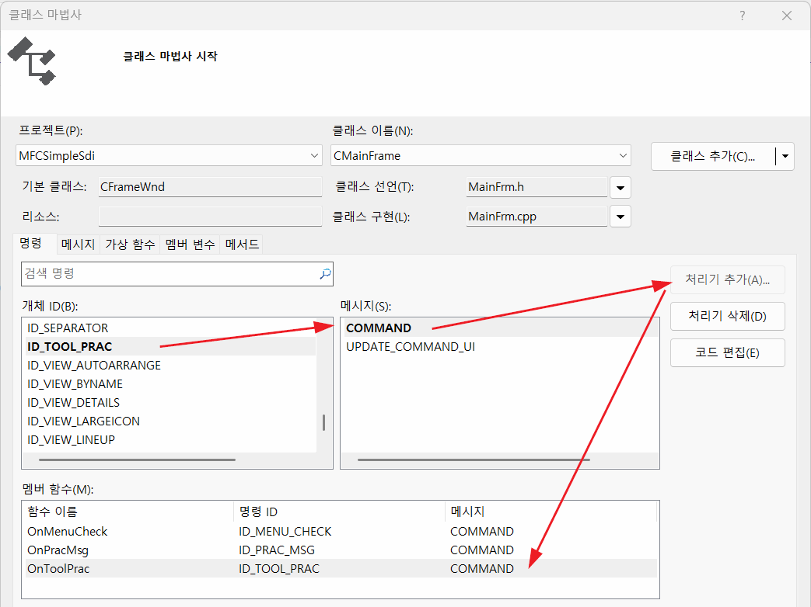

- 이벤트 추가

```cpp
void CMainFrame::OnToolPrac()
{
	OnPracMsg(); // 이전에 만들었던 메뉴 클릭함수 호출
}
```

- 메뉴 클릭 함수를 그대로 호출

##### 상태바

- 프로그램 내 여러 상태를 표시하는 컨트롤

```cpp
static UINT indicators[] =
{
	ID_SEPARATOR,         // 상태 줄 표시기
	ID_INDICATOR_CAPS,    // 캡락
	ID_INDICATOR_NUM,     // 넘버락
	ID_INDICATOR_SCRL,    // 스크롤락
};


```

- 상태바 객체변수는 MainFrame에 protected로 선언되어 자식창에서 접근불가

```cpp
void CMainFrame::SetStatusText(CString str)
{
	m_wndStatusBar.SetPaneText(0, str);
}
```

```cpp
#include "MainFrm.h"
```

- ChildView.cpp에 MainFrm.h 추가

```cpp
void CChildView::OnLButtonDown(UINT nFlags, CPoint point) {
	CString str;
	str.Format(L"(%d, %d)", point.x, point.y);

	CMainFrame* pFrame = (CMainFrame*)AfxGetMainWnd();  // 부모창 MainFrame 포인터 가져오기
	pFrame->SetStatusText(str); // 상태바 표시함수 호출
        ...

```

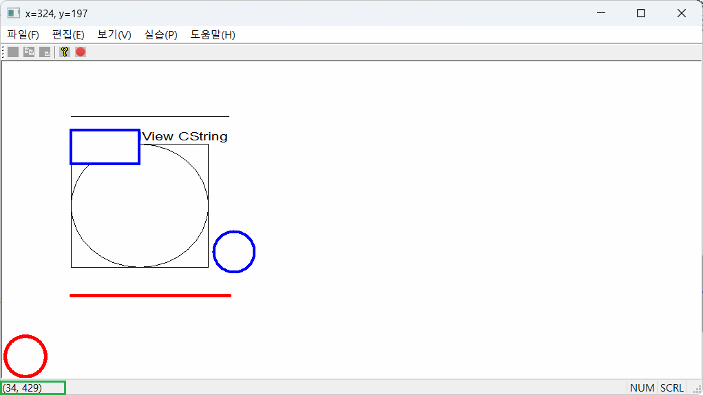

- 마우스 클릭위치 표시

##### Dialog

- Dialog Based MFC와 동일
- SDI나 MDI에서 파일오픈, 파일저장 등의 추가 팝업창을 띄울 때 사용

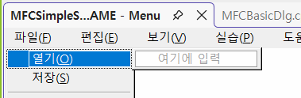

- 메뉴에서 열기(ID_FILE_OPEN), 저장(ID_FILE_SAVE) 생성

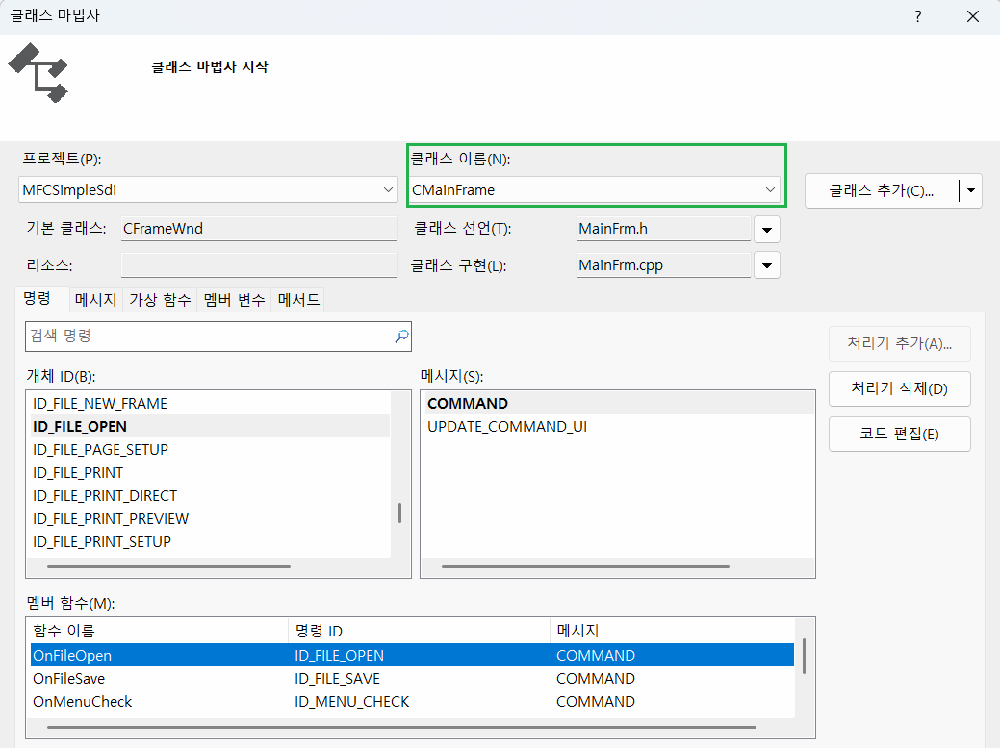

- 클래스 마법사 사용시 `클래스 이름` 선택 주의!

```cpp
void CMainFrame::OnFileOpen()
{
	CFileDialog dlg(
		TRUE,
		L"txt",
		NULL,
		OFN_FILEMUSTEXIST | OFN_HIDEREADONLY,
		L"텍스트 파일 (*.txt)|*.txt|모든 파일 (*.*)|*.*||"
		);
	CString path;

	if (dlg.DoModal() == IDOK) {
		// 파일을 선택했으면 처리
		path = dlg.GetPathName();

		m_wndStatusBar.SetPaneText(0, path);
	}
}
```

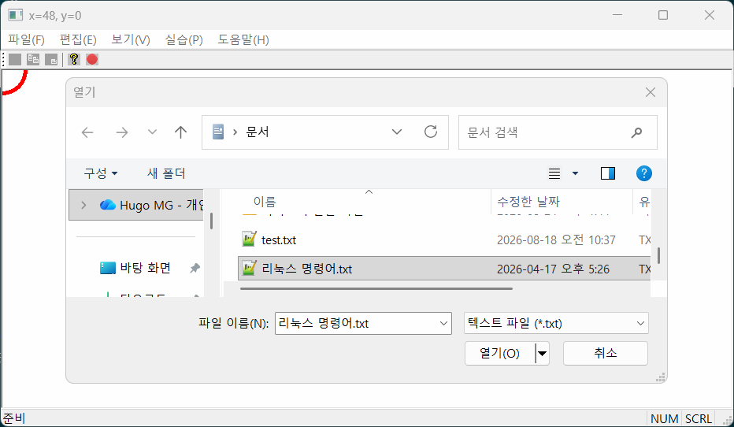

- 파일 오픈 다이얼로그

```cpp
CFileDialog dlg(
		FALSE,     // 파일 저장
		L"txt",
		NULL,
		OFN_FILEMUSTEXIST | OFN_HIDEREADONLY,
		L"텍스트 파일 (*.txt)|*.txt|모든 파일 (*.*)|*.*||"
		);
```

##### Custom Dialog

- 메뉴 프로젝트 > 클래스 마법사 > 클래스 추가 > MFC 클래스

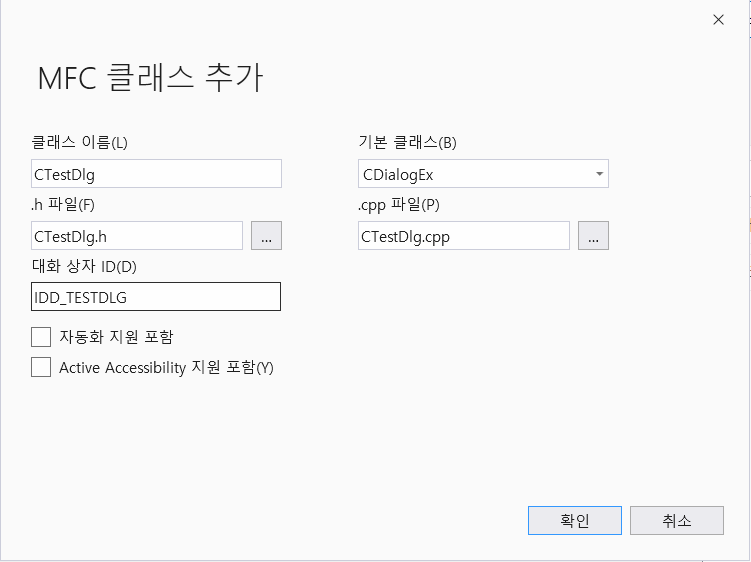

- 입력 후 확인

```cpp
void CMainFrame::OnPracMsg()
{
	AfxMessageBox(L"Hello, MFC!");

	CTestDlg dlg;   // include 필요!
	dlg.DoModal();
}
```

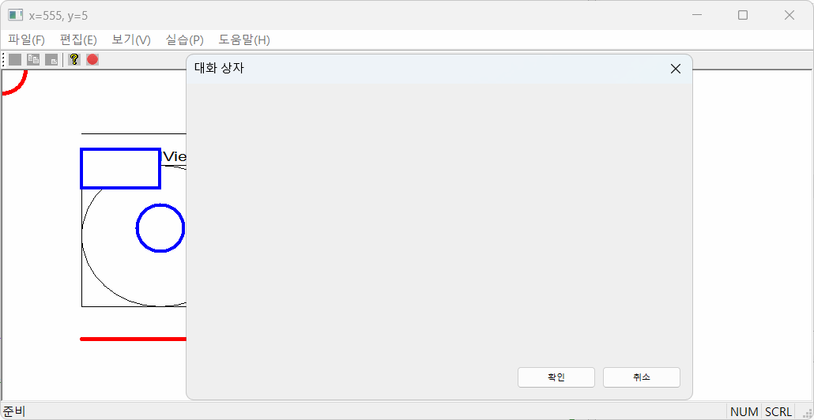

- 커스텀 다이얼로그 실행화면

##### MFC 스레드

- Process와 Thread 차이
  - Process : 하나의 실행파일
  - Thread : 실행파일 내 CPU가 실제로 실행하는 작업 흐름. 시분할로 여러개를 나눠서 실행

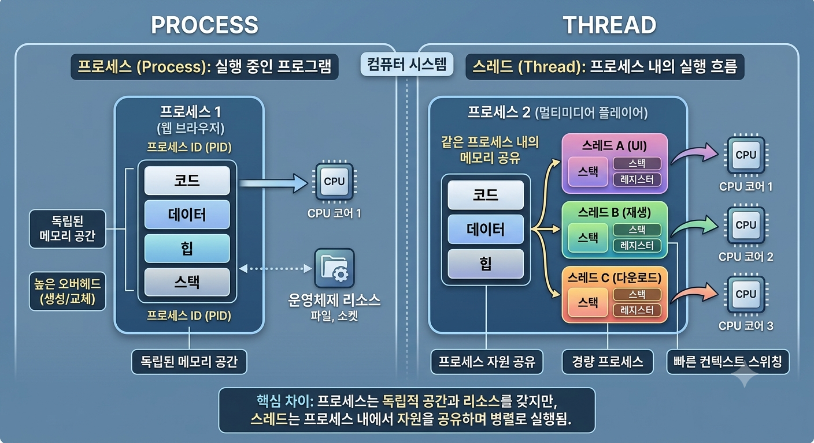

- AfxBeginThread() 함수로 시작

```cpp
CWinThread* AfxBeginThread(
    AFX_THREADPROC pfnThreadProc,    // AFX_THREADPROC - Thread 함수의 주소. 이 함수를 실행하라는 의미
    LPVOID pParam                    // void* - 아무 자료형이나 전달가능
);
```

- Thread 함수

```cpp
UINT ThreadProc(LPVOID pParam) {    // UINT - 종료하면서
   ....
   return 0;    // 정상종료
}
```

- 스레드 실행

```cpp
AfxBeginThread(ThreadProc, NULL);
```

- MFC Dialog 프로젝트

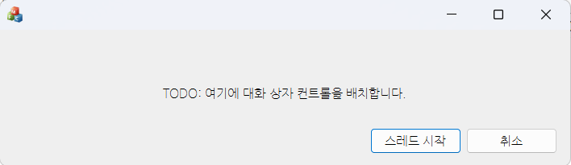

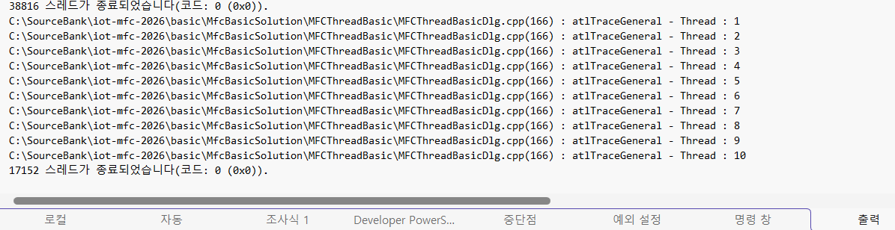

```cpp
void CMFCThreadBasicDlg::OnBnClickedBtnThread()
{
	AfxBeginThread(ThreadProc, NULL);  // 스레드 호출

	//AfxMessageBox(L"Main Thread");
	TRACE(L"Main Thread\n");
}

UINT CMFCThreadBasicDlg::ThreadProc(LPVOID pParam)
{
	for (int i = 1; i <= 10; i++) {
		TRACE(L"Thread : %d\n", i);

		Sleep(1000); // 1초 대기
	}

	return 0;
}

```

- 스레드 시작 버튼을 누를때 마다 신규 스레드 계속 생성

```cpp
void CMFCThreadBasicDlg::OnBnClickedBtnThread()
{
	int value = 100;

	AfxBeginThread(ThreadProc, &value);  // 스레드 호출

	//AfxMessageBox(L"Main Thread");
	TRACE(L"Main Thread\n");
}

UINT CMFCThreadBasicDlg::ThreadProc(LPVOID pParam)
{
	int* pValue = (int*) pParam;
	int param = *pValue;

	for (int i = 1; i <= 10; i++) {
		TRACE(L"Thread : %d - %d\n", i, param);

		Sleep(1000); // 1초 대기
	}

	return 0;
}
```

- 파라미터 전달해서 스레드 호출
- WPF, C# WinForm(Python 동일) 스레드에서 UI를 직접 수정하지 말 것

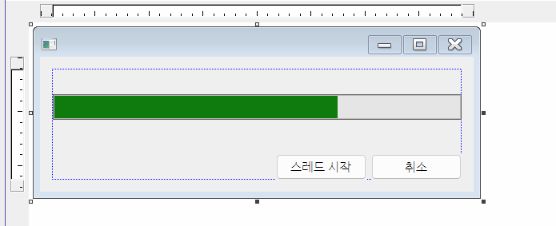

- 프로그레스바 추가

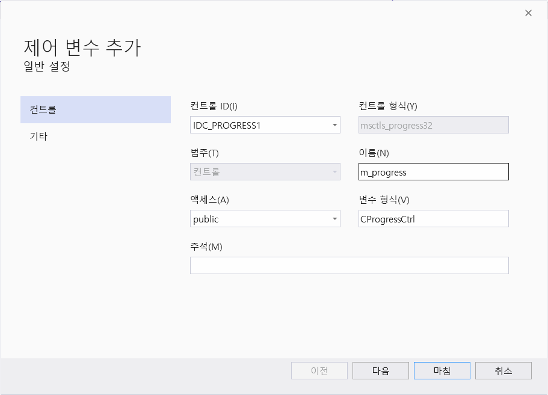

- DDX -Control 변수 추가

```cpp
BOOL CMFCThreadBasicDlg::OnInitDialog()
{
	CDialogEx::OnInitDialog();
	...
	// TODO: 여기에 추가 초기화 작업을 추가합니다.
	m_progress.SetRange(0, 1000);
	m_progress.SetPos(0);

	return TRUE;  // 포커스를 컨트롤에 설정하지 않으면 TRUE를 반환합니다.
}

void CMFCThreadBasicDlg::OnBnClickedBtnThread()
{
	AfxBeginThread(ThreadProc, this);  // this, Dialog를 Thread에게 전달. UI에 있는 컨트롤 직접 제어
	TRACE(L"Main Thread\n");
}

UINT CMFCThreadBasicDlg::ThreadProc(LPVOID pParam)
{
	CMFCThreadBasicDlg* pDlg = (CMFCThreadBasicDlg*)pParam;

	for (int i = 0; i <= 1000; i++) {
		pDlg->m_progress.SetPos(i);   // UI를 제어!
		Sleep(5); // 50ms 딜레이
	}
	return 0;
}

```

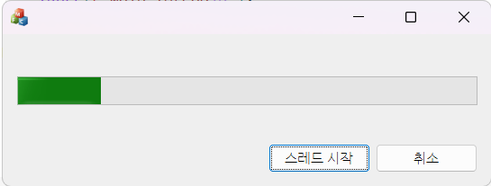

- 실행이 잘 될수 있고, 안될 수도 있음
- Main Thread가 UI를 관리하는데 사용자 스레드가 프로그레스바(UI)를 제어하고 있음
- 직접 제어하지 말고 메인 스레드에게 UI변경을 요청하도록 변경

```cpp
#define WM_PROGRESS_UPDATE (WM_USER + 1)  // 프로그레스바위해서 새로 만드는 메시지
```

- 새로운 윈도우 메시지 생성

```cpp
BEGIN_MESSAGE_MAP(CMFCThreadBasicDlg, CDialogEx)
	ON_WM_SYSCOMMAND()
	ON_WM_PAINT()
	ON_WM_QUERYDRAGICON()
	ON_BN_CLICKED(IDC_BTN_THREAD, &CMFCThreadBasicDlg::OnBnClickedBtnThread)

	ON_MESSAGE(
		WM_PROGRESS_UPDATE,
		&CMFCThreadBasicDlg::OnProgressUpdate)
END_MESSAGE_MAP()

```

- 다이얼로그 메시지맵에 ON_MESSAGE 추가

```cpp
afx_msg LRESULT OnProgressUpdate(WPARAM wParam, LPARAM lParam);
```

- 헤더에 OnProgressUpdate() 선언

```cpp
UINT CMFCThreadBasicDlg::ThreadProc(LPVOID pParam)
{
	CMFCThreadBasicDlg* pDlg = (CMFCThreadBasicDlg*)pParam;

	for (int i = 0; i <= 1000; i++) {
		//pDlg->m_progress.SetPos(i);
		// 윈도우 메시지에게 프로그레스바 값 변경을 대신 요청
		pDlg->PostMessage(WM_PROGRESS_UPDATE, i, 0);

		Sleep(5); // 50ms 딜레이
	}

	return 0;
}

LRESULT CMFCThreadBasicDlg::OnProgressUpdate(WPARAM wParam, LPARAM lParam)
{
	m_progress.SetPos((int)wParam);

	return LRESULT();
}
```

- 결론 : UI스레드(메인스레드)와 사용자스레드는 분리할 것!!

#### 메모장 프로젝트

- SDI 시작

##### ChildView에 Edit Control 추가

```cpp
public:
	CEdit m_edit;  // 에디트 컨트롤
```

##### 메시지맵 추가

```cpp
BEGIN_MESSAGE_MAP(CChildView, CWnd)
	ON_WM_CREATE()
	ON_WM_SIZE()
```

##### 함수 선언

```cpp
protected:
	afx_msg int OnCreate(LPCREATESTRUCT lpCreateStruct);
	afx_msg void OnSize(UINT nType, int cx, int cy);
```

##### 함수 정의 구현

```cpp
int CChildView::OnCreate(LPCREATESTRUCT lpCreateStruct)
{
	if (CWnd::OnCreate(lpCreateStruct) == -1)
		return -1;

	m_edit.Create(
		WS_CHILD | WS_VISIBLE |
		WS_BORDER | ES_MULTILINE |
		ES_AUTOVSCROLL | WS_VSCROLL,
		CRect(0, 0, 100, 100),  // w 100, h 100
		this,
		1000
	);

	return 0;
}

void CChildView::OnSize(UINT nType, int cx, int cy)
{
	CWnd::OnSize(nType, cx, cy);

	if (m_edit.GetSafeHwnd()) {
		m_edit.MoveWindow(0, 0, cx, cy);
	}
}
```

##### 메뉴에서 보기 삭제

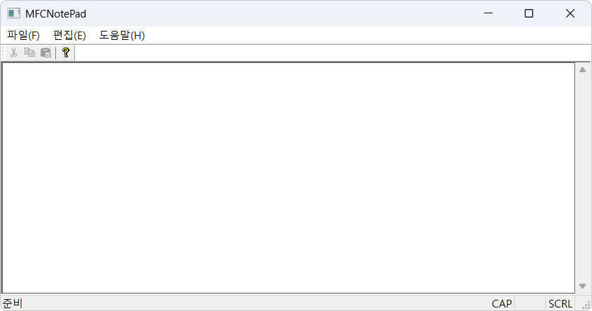

- 실행화면

##### 텍스트 파일 열기

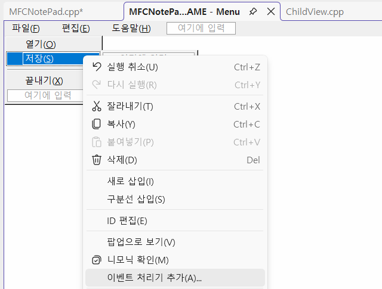

- 메뉴 리소스, 열기, 저장메뉴 추가
- 이벤트 처리기 추가

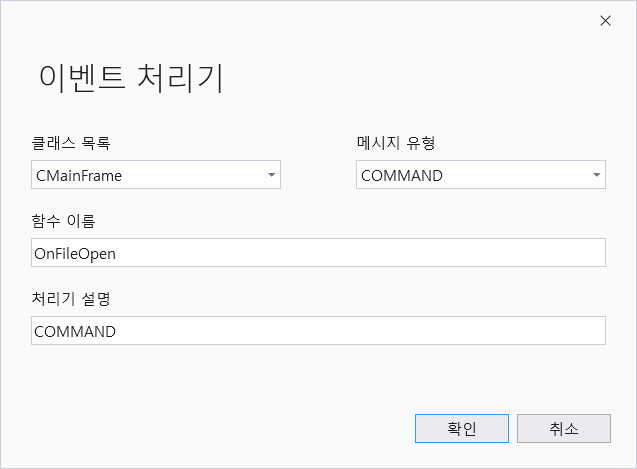

- 클래스 목록에서 CMainFrame으로 반드시 바꿀 것

```cpp
public:
	virtual ~CChildView();

	void SetText(const CString& text);
```

- ChildView 헤더에 SetText() 함수 선언

```cpp
void CChildView::SetText(const CString& text)
{
	m_edit.SetWindowText(text);
}
```

- SetText() 구현

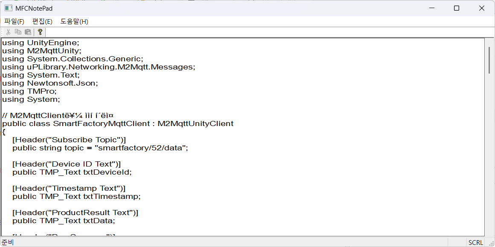

- 실행화면 - 한글 깨짐
- CStdioFile - 기본적으로 CP949(ANSI | EUC-KR) 기준으로 텍스트 로드
- CFile 로 변경 방법

```cpp
void CMainFrame::OnFileOpen()
{
	CFileDialog dlg(
		TRUE,
		L"txt",
		NULL,
		OFN_FILEMUSTEXIST | OFN_HIDEREADONLY,
		L"텍스트 파일 (*.txt)|*.txt||");

	if (dlg.DoModal() != IDOK)
		return;

	CString strPath;
	strPath = dlg.GetPathName();

	CFile file;

	if (!file.Open(strPath, CFile::modeRead)) {
		AfxMessageBox(L"파일을 열 수 없습니다.");
		return;
	}

	DWORD size = (DWORD)file.GetLength();
	std::vector<BYTE> buffer(size);
	file.Read(buffer.data(), size);

	file.Close();

	// UTF-8인지 EUC-KR인지 검사
	bool bUTF8 = false;
	int offset = 0;

	if (size >= 3 &&
		buffer[0] == 0xEF &&
		buffer[1] == 0xBB &&
		buffer[2] == 0xBF)
	{
		bUTF8 = true;
		offset = 3;
	}

	CString strText;

	if (bUTF8) {
		int len = MultiByteToWideChar(
			CP_UTF8,
			0,
			(LPCCH)(buffer.data() + offset),
			size - offset,
			NULL,
			0);

		MultiByteToWideChar(
			CP_UTF8,
			0,
			(LPCCH)(buffer.data() + offset),
			size - offset,
			strText.GetBuffer(len),
			len);

		strText.ReleaseBuffer(len);
	}
	else {
		int len = MultiByteToWideChar(
			CP_ACP,
			0,
			(LPCCH)buffer.data(),
			size,
			NULL,
			0);

		MultiByteToWideChar(
			CP_ACP,
			0,
			(LPCCH)buffer.data(),
			size,
			strText.GetBuffer(len),
			len);

		strText.ReleaseBuffer(len);
	}

	m_wndView.SetText(strText);  // ChildView에 추가한 함수 호출
}
```

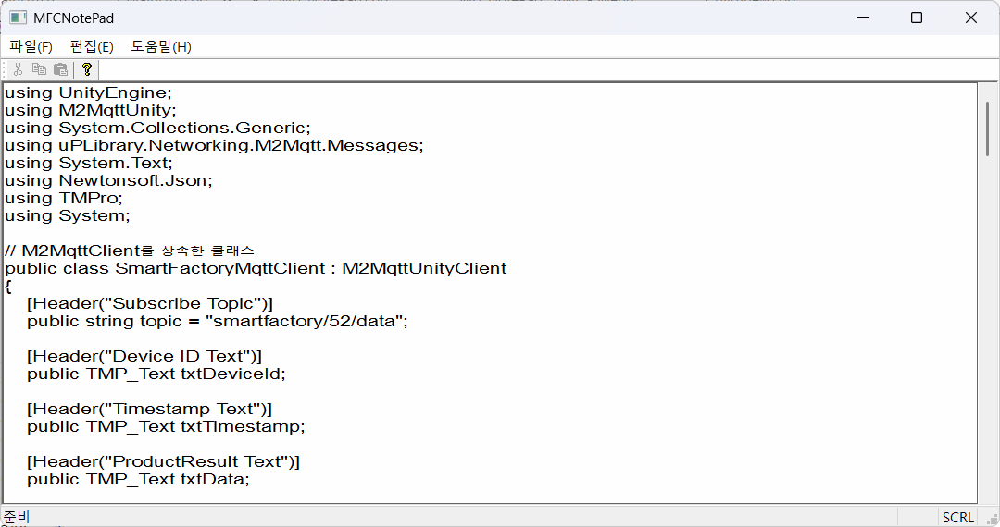

- 한글 문제 해결

##### 텍스트 저장

```cpp
CString GetText();
```

- ChildView.h 에 선언추가

```cpp
CString CChildView::GetText()
{
	CString str;
	m_edit.GetWindowText(str);
	return str;
}
```

- ChileView GetText() 함수 구현

```
void CMainFrame::OnFileSave()
{
	CFileDialog dlg(
		FALSE,
		L"txt",
		L"NewFile.txt",    // 기본 이름
		OFN_OVERWRITEPROMPT,
		L"텍스트 파일 (*.txt)|*.txt||");

	if (dlg.DoModal() != IDOK)
		return;

	CString strPath = dlg.GetPathName();

	CString strText = m_wndView.GetText();

	CStringA utf8 = CW2A(strText, CP_UTF8);
	CFile file;

	if (!file.Open(strPath, CFile::modeCreate | CFile::modeWrite))
	{
		AfxMessageBox(L"파일 저장 실패!");
		return;
	}

	// UTF-8 BOM
	BYTE bom[] = { 0xEF, 0xBB, 0xBF };
	file.Write(bom, sizeof(bom));

	file.Write(
		utf8.GetString(),
		utf8.GetLength());

	file.Close();

	AfxMessageBox(L"저장되었습니다.");
}
```

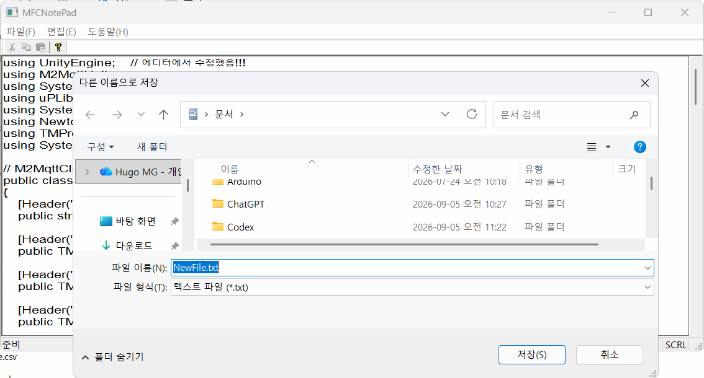

- 실행결과
- 새 문서, 툴바 기능, 상태바 표시 기능 추가

#### MFC 학습 순서

1. [x] Dialog Based MFC
2. [x] CWinApp / CDialogEx 이해
3. [x] Resource Editor
4. [x] Button / Static / Edit / CheckBox / Radio Button 컨트롤 학습
5. [x] 컨트롤 사용 간단 프로젝트
6. [x] Message Map 이해
7. [x] 이벤트 처리 방법 이해
8. [x] 컨트롤 값 읽기 / 쓰기
9. [x] DDX / DDV
10. [x] Timer
11. [x] SDI(Single Document Interface)
12. [x] GDI(Graphic Device Interface) : 원, 사각형 그래픽 그리기
13. [x] 메뉴
14. [x] 툴바
15. [x] Dialog
16. [ ] ~~MDI(Multiple DI)~~
17. [x] 스레드...
18. [x] 토이프로젝트 : 메모장(NotePad) 프로젝트
